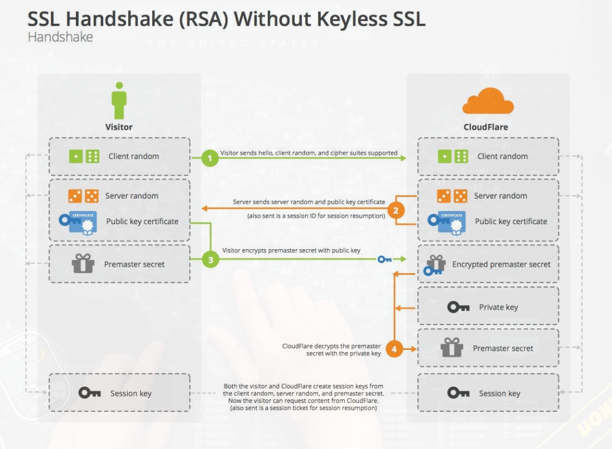

## TLS 会话加密过程

> TLS: transfer layer security, 是 SSL（security socket layer）的今生.
> https 请求就是在建立TCP连接后，做了协商会话密钥的步骤。

我们来模拟下协商过程：
<pre>
客户端：Hi，服务端，我这边支持这些算法，这是我本次的随机数。
服务端：好的，我看看，我们就选用这个算法套件吧，这是我本次的随机数，这是我的证书，你用这个证书里的公钥来加密预主密钥。
客户端：稍等我验下证书，嗯，的确是服务端的证书。这是用证书中公钥加密的预主密钥。（使用两个随机数+预主密钥计算主密钥，然后生成会话密钥。。。）好了，我这边OK了。
服务端：收到。（用私钥解密出预主密钥，使用两个随机数+预主密钥计算主密钥，然后生成会话密钥。。。）好了，我这边也OK了。
客户端：这是加密的应用数据。。。
服务端：这是加密的应用数据。。。
注：上面的流程是单向认证（服务端没有验证客户端的身份），如果服务端也需要验客户端的身份，会在第一次交互中发送Certificate Request消息，客户端相应的在第二次交互中发送自己的Certificate以及CertificateVerify消息给服务端。
</pre>

ps: 上述摘自 https://catbro666.github.io/posts/e92ef4b4/