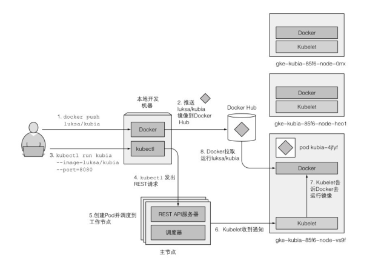

# Kubernetes-in-action (一)

> 链接为书内容中对应代码的地址：https://github.com/luksa/kubernetes-in-action
> 本节内容：docker 基础, Pod
---

## 前置之 docker 基础

- 安装docker
- 使用docker安装镜像、进入镜像，查看进行信息
  ```shell
  docker build -t kubia . # 使用当前目录的Dockerfile构建镜像，镜像名为 kubia， 版本默认lates
  docker run --name kubia-container -p 8081:8080 -d kubia # 启动一个容器名为kubia-container， 并且宿主机的8081对应容器的8080端口，-d 后台启动
  docker inspect kubia-container # 查看容器的信息
  docker exec -it kubia-container bash # 进去容器的控制台，-i 确保标准输入流开发，-t 分配伪终端
  docker stop kubia-container # 停止容器运行
  docker rm kubia-container # 删除容器，必须在停止后删除
  docker tag kubia yzh001/kubia # 为kubia添加tag，等同一个新的image，tag不同。 yzh001可以换成自己docker hub id
  docker push yzh001/kubia # 上传新的image到自己仓库，要登入docker，使用 `docker login` 命令
  ps aux # 查看系统进程 
  ```

> 容器的有自己的进程树，所以pid与宿主机隔离，但是仍可以发现容器内运行的进程，也在宿主机的进程表中

## Kube (官网 http://kubernetes.io)

#### 安装方式

- kubeadm
- Minikube
- 云服务器

#### 工作流程



## Pod

#### 基础命令

```shell
kubectl create -f xxx.yaml # 根据yaml安装pod、service..
kubectl get pods # 获取pod信息，加 -o wide 获取更多信息
kubectl delete pod pod-name # 删除pod， 加上 -all 既删除当前空间下所有pod
kubectl port-forward pod-name local-port:pod-port # 端口转发，如此可以通过访问本地端口来访问pod
  ```

#### 使用 label 管理 pod

- 命令
  ```shell
  kubectl label po kubia-manual-v2 creation_method=manual [--overwrite] # 添加标签，如果覆盖要加overwrite
  kubectl get po -l app=nginx # 找label KV 一样的pod
  kubectl get po -l '!env' # 找 label没有env的pod
  kubectl get po -L app # 显示标签 app 在每个pod后面
  kubectl delete po -l k=v # 删除所有符合的label的pod
  ```
- 功能
    - 可以为pod配置nodeSelector，来确定pod应该被分配到哪个node。 node具有某些特别的label，如ssd=true...

#### pod的注解

- 作用： 用来给pod做说明
- 命令
  ```shell
  kubectl annotate pod kubia-manual-v2 my.com/someannotation="foo bar" # 添加注解，使用特别前缀，以防被系统自带的注解覆盖
  kubectl describe pod kubia-manual-v2 | grep Annotation # 查看注解
   ```

#### 命名空间

- 作用：用来环境隔离，但是不一定隔离网络，既空间A的Apod可以访问空间B的Bpod，这个取决于网络策略。
- 命令
  ```shell
  kubectl get ns #获取命名空间信息
  kubectl get po -n kube-system # 获取命名空间的所有pod
  kubectl create namespace custom-namespace #创建一个命名空间，也可以用yaml文件创建
  kubectl create -f kubia-manual-with-labels.yaml -n custom-namespace # 在某个命名空间种创建资源
  kubectl delete ns custom-namespace # 删除命名空间，同时会删除空间下的所有pod
  kubectl delete all -all # 删除空间下所有资源
  ```

#### Q&A

- 为何推荐一个容器只有一个进程? 因为这样管理容器时只要专注于一件事情，减少复杂度
- 扩容后为何不会端口冲突? 因为每个pod的ip都不一样，

> 金丝雀发布： 先让一部分用户先体验新功能，在让其他用户也使用。

到此为前三章结束。